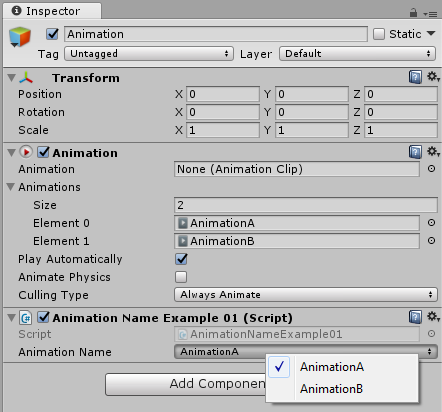
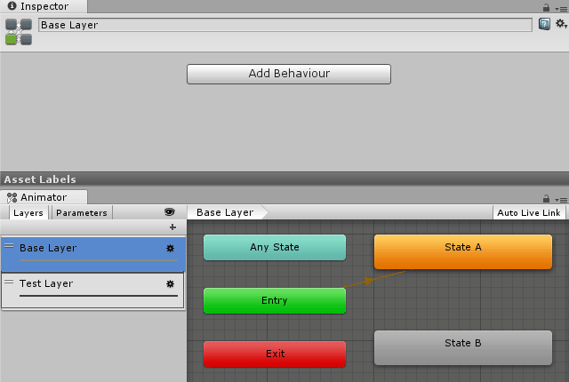

# Unity Forge Property Drawers [](http://mit-license.org)
Custom propery drawers to ease fields value management in Unity editor.

## Attributes list
* [AnimationName](#animationname)
* [AnimatorLayerName](#animatorlayername)
* [AnimatorStateName](#animatorstatename)

## Attributes usage
Import `UnityForge` namespace to be able to use attribute from the [attributes list](#attributes-list)

## AnimationName


### Attribute usage
Add attribute to string field to enable selection of animation name value from dropdown list in Unity editor. Attribute without parameters works on Animation component attached to inspected object.
```csharp
[SerializeField, AnimationName]
private string animationName;
```

Specify animation component via `animationField` constructor parameter to enable animation name selection from that component.
```csharp
[SerializeField]
private Animation exampleAnimation;
[SerializeField, AnimationName(animationField: "exampleAnimation")]
private string animationName;
```

[Examples of attribute usage](../master/Source/Examples/AnimationName)

### Caveats
Unity manages clips internally specifically so for some reason order of clips returned by [AnimationUtility.GetAnimationClips](https://docs.unity3d.com/ScriptReference/AnimationUtilityGetAnimationClips.html) differs from the one displayed in the editor for Animation comoponent. Due to this expect different order of items in dropdown list for attribute.

## AnimatorLayerName
Add attribute to string field to enable selection of animator layer name value from dropdown list in Unity editor. Attribute without parameters works on Animator component attached to inspected object.
```csharp
[SerializeField, AnimatorLayerName]
private string layerName;
```

Specify Animator component via `animatorField` constructor parameter to enable layer name selection from that Animator component.
```csharp
[SerializeField]
private Animator exampleAnimator;
[SerializeField, AnimatorStateName(animatorField: "exampleAnimator")]
private string exampleLayerName;
```

[Examples of attribute usage](../master/Source/Examples/AnimatorLayerName)

## AnimatorStateName


### Attribute usage
Add attribute to string field to enable selection of animator state name value from dropdown list in Unity editor. Attribute without parameters works on Animator component attached to inspected object.
```csharp
[SerializeField, AnimatorStateName]
private string stateName;
```

Specify Animator component via `animatorField` constructor parameter to enable state name selection from that Animator component.
```csharp
[SerializeField]
private Animator exampleAnimator;
[SerializeField, AnimatorStateName(animatorField: "exampleAnimator")]
private string exampleStateName;
```

[Examples of attribute usage](../master/Source/Examples/AnimatorStateName)

### Caveats
Since layer index is [decoupled](https://docs.unity3d.com/ScriptReference/Animator.Play.html) from animator state name in Unity API, state name alone does not determine state and state index value should be managed separately. If only one animation layer is used, it's not the problem and `Play(string stateName)` overload can be used safely for fields using `AnimatorStateName` attribute.
